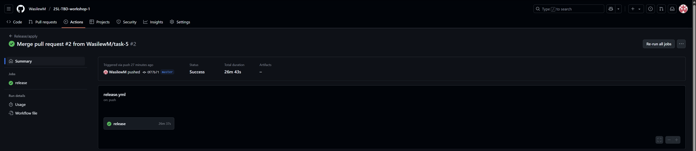
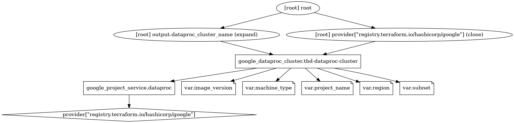
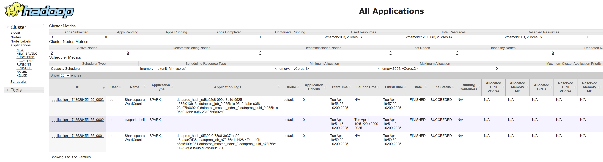
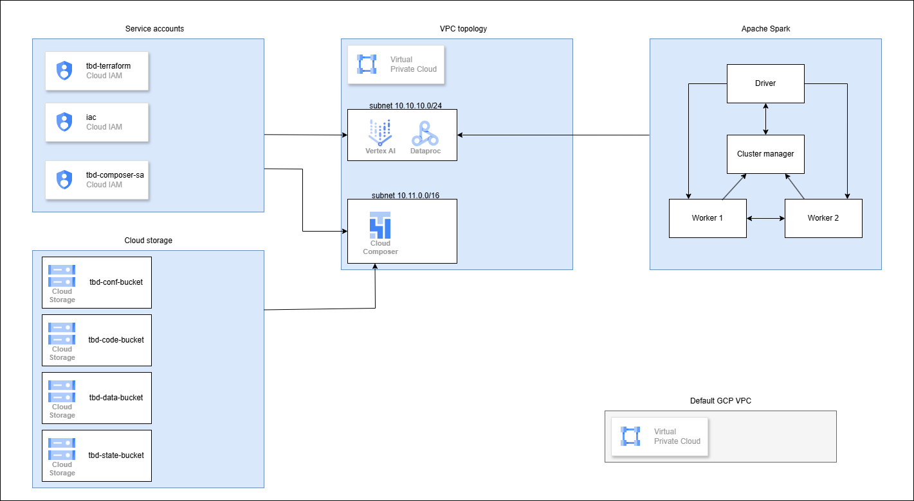
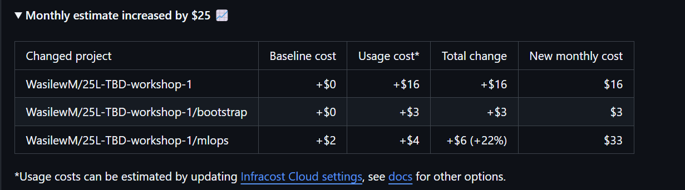
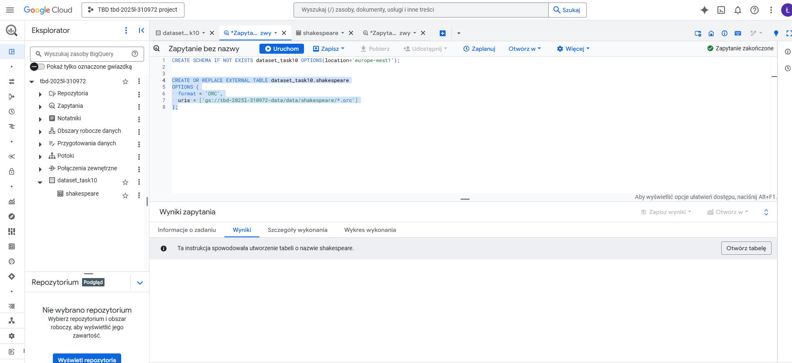
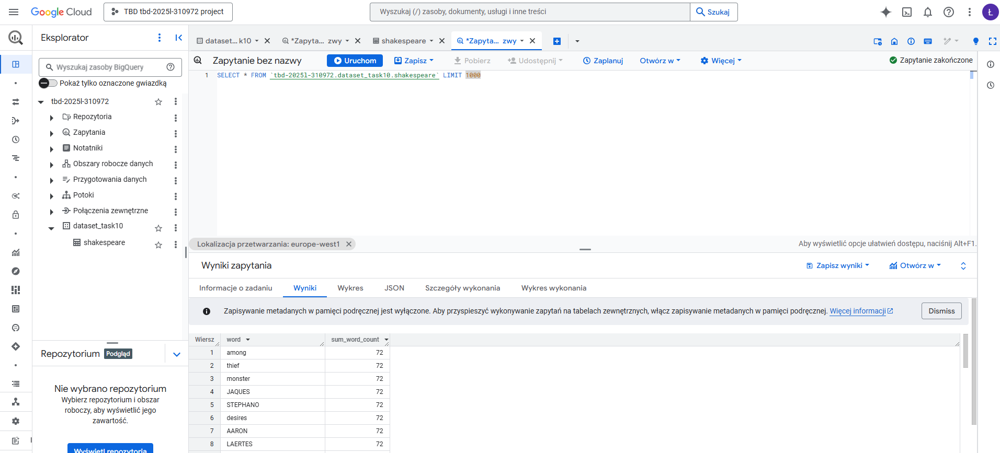

IMPORTANT ❗ ❗ ❗ Please remember to destroy all the resources after each work session. You can recreate infrastructure by creating new PR and merging it to master.
  


1. Authors:

   Group 5
- Sypuła Aleksandra  
- Szarejko Łukasz  
- Wasilewski Mateusz  

   https://github.com/WasilewM/25L-TBD-workshop-1.git
   
2. Follow all steps in README.md.

3. In boostrap/variables.tf add your emails to variable "budget_channels".

4. From avaialble Github Actions select and run destroy on main branch.
   
5. Create new git branch and:
    1. Modify tasks-phase1.md file.
    
    2. Create PR from this branch to **YOUR** master and merge it to make new release. 
    
    


6. Analyze terraform code. Play with terraform plan, terraform graph to investigate different modules.

    

`google_dataproc_cluster.tbd-dataproc-cluster`: This resource defines a Dataproc cluster in Google Cloud. Dataproc is a managed service that allows you to run computations using Apache Hadoop and Apache Spark in the cloud.

- **`google_project_service.dataproc`**: Enables the Dataproc service in the Google Cloud project, which is necessary for creating the cluster.

- **`google_dataproc_cluster.tbd-dataproc-cluster`**: Defines the Dataproc cluster:
   - **`depends_on`**: Ensures that the Dataproc service is enabled before creating the cluster.
   - **`name`**: The name of the cluster, in this case, "tbd-cluster".
   - **`project`**: Specifies the name of the project in which the cluster is created.
   - **`region`**: The region where the cluster is deployed.

- **`cluster_config`**: Section that defines the configuration of the cluster:
   - **`software_config`**: Allows the specification of the software version to be used on the cluster.
   - **`gce_cluster_config`**: Configuration related to GCE (Google Compute Engine) instances, including information about the subnet and metadata.
   - **`initialization_action`**: Specifies a script to be run during the initialization of the cluster, in this case, a script that installs Python packages.
   
- **`master_config`**: Defines the configuration for the master node:
   - **`num_instances`**: The number of instances for the master node.
   - **`machine_type`**: The machine type for the master node.
   - **`disk_config`**: Specifies the type and size of the boot disk.
   
- **`worker_config`**: Defines the configuration for worker nodes:
   - **`num_instances`**: The number of instances for the worker nodes.
   - **`machine_type`**: The machine type for the worker nodes.
   - **`disk_config`**: Specifies the type and size of the boot disk for the worker nodes.

7. Reach YARN UI
   
   Used command:  
   ```
   gcloud compute ssh tbd-cluster-m --project=tbd-2025l-310972 --zone=europe-west1-d --tunnel-through-iap -- -L 8088:localhost:8088
   ```
   
   
8. Draw an architecture diagram (e.g. in draw.io) that includes:
    1. VPC topology with service assignment to subnets
    2. Description of the components of service accounts
         - **tbd-composer-sa**: This service account is dedicated to managing and operating Cloud Composer environments, Dataproc clusters, and related tasks. It has the necessary permissions to orchestrate workflows and interact with other Google Cloud services.

         - **tbd-terraform**: This service account is dedicated to managing infrastructure within Google Cloud through Terraform. It is linked to the project specified by `google_project.tbd_project.project_id` and is identified by the account ID `${local.project}-lab`. This account facilitates the deployment, updates, and configuration of resources defined in Terraform scripts, ensuring that the infrastructure is provisioned and maintained according to the desired state defined in the code.

         - **iac**: This service account is responsible for implementing and maintaining Infrastructure as Code (IaC) configurations within the project. It supports integrations between GitHub and Google Cloud, enabling automated deployments and version control for infrastructure changes.

    3. List of buckets for disposal
         - **tbd-2025l-310972-conf**: stores configuration files and scripts associated with the project. It includes any necessary setup scripts or parameter files required for deployment.
         - **tbd-2025l-310972-code**: stores executable code, source code, and Apache Spark libraries. It is where all  the code artifacts required for running applications and jobs are stored.
         - **tbd-2025l-310972-data**: stores data generated by applications. It is used for both input and output data needed for processing tasks.
         - **tbd-2025l-310972-state**: stores information about the infrastructure and its current state. It serves as a source of truth for tracking changes and configurations.
  
    4. Description of network communication (ports, why it is necessary to specify the host for the driver) of Apache Spark running from Vertex AI Workbench
       - **10.10.10.2**: **tbd-cluster-w-1** - Worker Node
       - **10.10.10.3**: **tbd-cluster-w-0** - Worker Node
       - **10.10.10.4**: **tbd-cluster-m** - Master Node
       - **10.10.10.5**: **tbd-2025l-310972-notebook** - Driver (Jupyter Notebook VM)
       - **Driver Port: 30000** - Manages communication between the driver and cluster components.
       - **Block Manager Port: 30001** - Facilitates the transfer of data blocks between instances in the cluster, ensuring smooth delivery of results.
       - Ports in Apache Spark running from Vertex AI Workbench  ensure smooth communication between its components. The Driver Port (30000) manages job execution across the cluster, while the Block Manager Port (30001) enables efficient data exchange. Specifying the Driver's host ensures all cluster nodes can correctly route their communications.
  
    

9.  Create a new PR and add costs by entering the expected consumption into Infracost
For all the resources of type: `google_artifact_registry`, `google_storage_bucket`, `google_service_networking_connection`
create a sample usage profiles and add it to the Infracost task in CI/CD pipeline. Usage file [example](https://github.com/infracost/infracost/blob/master/infracost-usage-example.yml) 


```
version: 0.1
resource_usage:
  google_artifact_registry_repository:
    storage_gb: 64
    monthly_egress_data_transfer_gb:
      europe_west1: 16
  google_storage_bucket:
    storage_gb: 128
    monthly_class_a_operations: 4096
    monthly_class_b_operations: 8192
    monthly_data_retrieval_gb: 32
    monthly_egress_data_transfer_gb:
      same_continent: 32
      worldwide: 0
      asia: 0
      china: 0
      australia: 0
  google_service_networking_connection:
    monthly_egress_data_transfer_gb:
      same_region: 16
      europe: 16
      us_or_canada: 0
      asia: 0
      south_america: 0
      oceania: 0
      worldwide: 16
```

   

10. Create a BigQuery dataset and an external table using SQL
    
    ```
    CREATE SCHEMA IF NOT EXISTS dataset_task10 OPTIONS(location='europe-west1');

    CREATE OR REPLACE EXTERNAL TABLE dataset_task10.shakespeare
    OPTIONS  {
        format = 'ORC',
        uris = ['gs://tbd-2025l-310972-data/data/shakespeare/*.orc']
    }
    ```

    
    
   
    ORC files inherently contain their own schema, removing the need for a separate table schema definition.

11. Find and correct the error in spark-job.py

    There was a need to update the `student_id` in `modules/data-pipeline/resources/spark-job.py`.:  
    changed from
    ```
    DATA_BUCKET = "gs://tbd-2025l-9900-data/data/shakespeare/"
    ```
    to:
    ```
    DATA_BUCKET = "gs://tbd-2025l-310972-data/data/shakespeare/"
    ```

12. Add support for preemptible/spot instances in a Dataproc cluster

    Modifications were added to `modules/dataproc/variables.tf` variables file located [here](modules/dataproc/variables.tf): 
    ```
    variable "worker_count" {
        type        = number
        default     = 2
        description = "Number of worker nodes"
    }
    ```
    and to `modules/dataproc/main.tf` file located [here](modules/dataproc/variables.tf):
    ```
    worker_config {
        num_instances = var.worker_count
        machine_type  = var.machine_type
        disk_config {
            boot_disk_type    = "pd-standard"
            boot_disk_size_gb = 100
        }
    }
    ```
    
